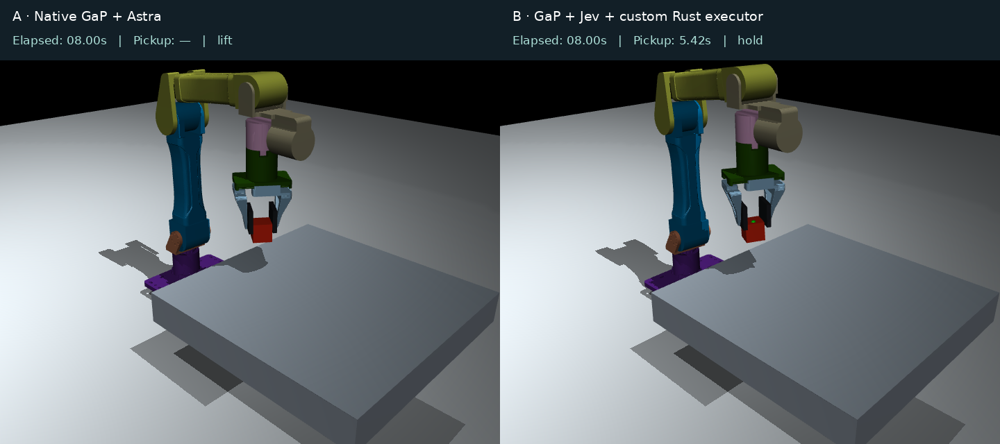
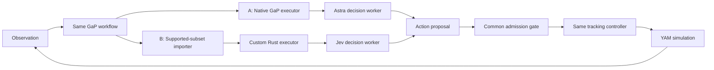

# JevGaP

An experimental benchmark for graph-based robot policies: **native GaP + Astra**
versus **GaP + Jev + a custom Rust executor**.

The same policy graph produces action proposals for a shared controller. This
repository includes a Rust executor, Python workers, MuJoCo YAM demonstrations,
timing logs and reproducible result summaries.

| System | Graph | Executor | Decision model |
|---|---|---|---|
| **A** | GaP workflow | Native GaP | OpenAI GPT-6 Astra |
| **B** | Same GaP workflow | Custom Rust executor | TypeSafe Jev |



**[Watch the side-by-side demo](docs/assets/moving-cube.mp4)** ·
[Results and limitations](docs/results.md) · [Architecture](docs/architecture.md) ·
[YAM hardware guide](docs/hardware.md)

## How GaP, Jev and the Rust executor work together

**GaP supplies the workflow format and the native executor used by A.** We build
on [graph-robots/graph-as-policy](https://github.com/graph-robots/graph-as-policy),
pinned by `gap-commit.txt`. Our selected graph has three steps: prepare the
observation, request a decision, and produce an action proposal.

These are custom benchmark workers registered through GaP's `ToolRegistry`.
This experiment does not use GaP's existing robot skill catalog. The shared
YAM tracking and grasp controller is also custom.



In **A**, upstream GaP executes the graph and calls Astra through our Python
decision worker. Its scheduler and normal tracing are preserved.

In **B**, our importer reads the same graph into a limited Rust representation.
The Rust executor starts a node when its required control and data inputs are
ready. It calls persistent Python workers over Unix-domain sockets and collects
their results. The decision worker calls **Jev**, which chooses one of
`continue`, `reperceive`, `replan` or `abort`. B uses GaP's graph specification;
it does not run the native GaP executor inside Rust.

Both paths return an `ActionProposal` carrying the observation identity and
timestamp. The shared gate checks it before the controller acts. Neither model
receives an actuator handle or writes motor commands.

For the moving-cube demo, the model authorizes pickup once. The same controller
then tracks the cube using live simulator state, closes the fingers, lifts and
holds it. The model is not the low-level motion controller. The joint-target
pilot instead requests repeated decisions as observations arrive.

The purpose is to measure the complete decision-to-action path. Since B changes
both execution and the decision model, an A/B timing difference cannot tell us
how much came from Jev versus the Rust executor.

## Measured example

One matched moving-cube episode per system:

| System | Confirmed pickup | Retained at episode end |
|---|---:|---|
| A — Native GaP + Astra | 8.79 s | Yes |
| B — GaP + Jev + custom Rust executor | 5.42 s | Yes |

Pickup means the cube center is more than 5 cm above the table with opposing
finger contact sustained for 300 ms. Both episodes ran for 18 seconds with the
same initial state, model and controller. The video uses synchronized 1× wall-time
playback and shows the confirmed pickup time.

**This is an integration demo, not a statistical speedup claim.** The task uses
simulator ground truth and experimental fingertip contact pads. A deterministic
rule could authorize the same pickup. The comparison changes execution **and**
inference, so it does not isolate the Rust executor's contribution. No physical
hardware result or semantic-quality equivalence is claimed.

## Quick start

Use Ubuntu 24.04 or WSL2 for development. Use native Linux for published timing
studies. Keep the checkout, environment and outputs on Linux storage when possible.
Install Git, [uv](https://docs.astral.sh/uv/getting-started/installation/),
[Rust](https://rustup.rs/) and system OpenGL libraries first:

```bash
sudo apt-get update
sudo apt-get install -y build-essential pkg-config libegl1 libgl1 libglfw3
# From this repository's root:
bash scripts/setup.sh
bash scripts/check.sh
```

Setup fetches pinned GaP and I2RT checkouts into ignored `vendor/`, creates the
Python 3.12.3 environment under `$HOME/.local/share/rtbench/yam-venv`, and builds
Rust 1.98.1 under `$HOME/.cache/rtbench/target`. Dependency versions are committed.
`RTBENCH_ENV` and `CARGO_TARGET_DIR` override these locations. When overriding the
build directory, set `RTBENCH_BINARY` to its `release/rtbench-runtime` binary.

### Run locally without model APIs

```bash
PY="$HOME/.local/share/rtbench/yam-venv/bin/python"
"$PY" scripts/moving_cube.py --diagnostic --duration 18 \
  --output "$HOME/.local/share/rtbench/results/cube-check"
"$PY" scripts/cube_video.py "$HOME/.local/share/rtbench/results/cube-check" --diagnostic
```

This verifies contact-based pickup with a deterministic decision. It is **not**
an A/B model comparison. The diagnostic runs unpaced; its timeline is simulation
time. Choose a new output directory for every run.

### Run one live A/B pair

Create credential files outside the checkout, then provide their paths:

```bash
export ASTRA_KEY_FILE="/path/to/private/astra.key"
export JEV_KEY_FILE="/path/to/private/jev.key"
PY="$HOME/.local/share/rtbench/yam-venv/bin/python"
"$PY" scripts/moving_cube.py --live --duration 18 \
  --output "$HOME/.local/share/rtbench/results/cube-pair"
"$PY" scripts/cube_video.py "$HOME/.local/share/rtbench/results/cube-pair"
```

Live mode makes billable requests and sends synthetic task state to OpenAI and
TypeSafe. It does not transmit images or hardware data. Model IDs are
`gpt-6-astra` (low reasoning effort) and pinned `jev-1.13.0`. Local, shared spending
guards default to **$100 for Astra / $5 for Jev**; see [configuration](docs/configuration.md).

### Run the joint-target pilot

```bash
"$PY" scripts/yam_sim.py --live --pairs 5 --duration 12 \
  --output "$HOME/.local/share/rtbench/results/joint-pairs"
"$PY" scripts/yam_report.py "$HOME/.local/share/rtbench/results/joint-pairs"
```

Five pairs are ten episodes: one static pair, two early-change pairs and two
late-change pairs. `--diagnostic` substitutes local decisions for plumbing tests.

## Project layout

```text
crates/runtime/       Rust required-input scheduler and Unix-socket transport
scripts/              Executors, providers, simulation runners and analysis
workflows/yam_pickup/  Proposal-only GaP workflow
tests/                Gate, importer, contact and budget checks
docs/                 Methods, results, hardware guide and selected evidence
third_party/          Upstream license notices
```

The supported importer is deliberately limited: unconditional, single-scope
acyclic tool graphs with explicit input references. The selected linear graph
has native/Rust conformance evidence. Loops, streams, conditional branches,
subgraphs, recovery and arbitrary robot tools are rejected.

**Hardware execution is not implemented.** The simulation torque controller and
contact model must not be copied directly to a physical arm. The
[hardware guide](docs/hardware.md) describes SDK bring-up, calibration, shadow
testing and the controller bridge that must be implemented before A/B trials.

## Contributing and license

See [CONTRIBUTING.md](CONTRIBUTING.md) and [SECURITY.md](SECURITY.md).
Project code is licensed under [Apache-2.0](LICENSE). GaP, I2RT and other
dependencies retain their own licenses; see [third-party notices](THIRD_PARTY_NOTICES.md).
This project is independent of the upstream projects and model providers.

## Continuous-loop development

See [the continuous benchmark](docs/continuous.md) for repeated decisions, stale-response rejection, latency breakdowns and an experimental camera-derived state path. Offline checks use identical local workers and are separate from the Astra/Jev results above.

## Station integration

The [station runner](docs/station.md) provides observation-only shadow mode, fake-station fault tests, and a MuJoCo YAM adapter. Models and executors are selected independently of the station. Start with the offline examples; physical dispatch is not implemented. The [hardware worksheet](docs/station-worksheet.md) lists the information needed from an evaluation station.
